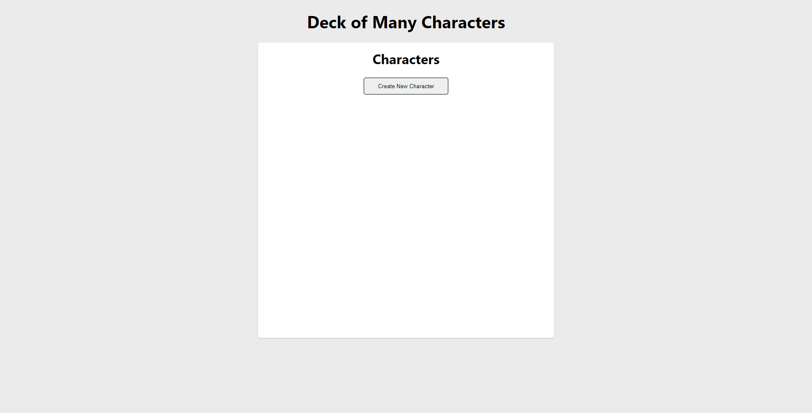
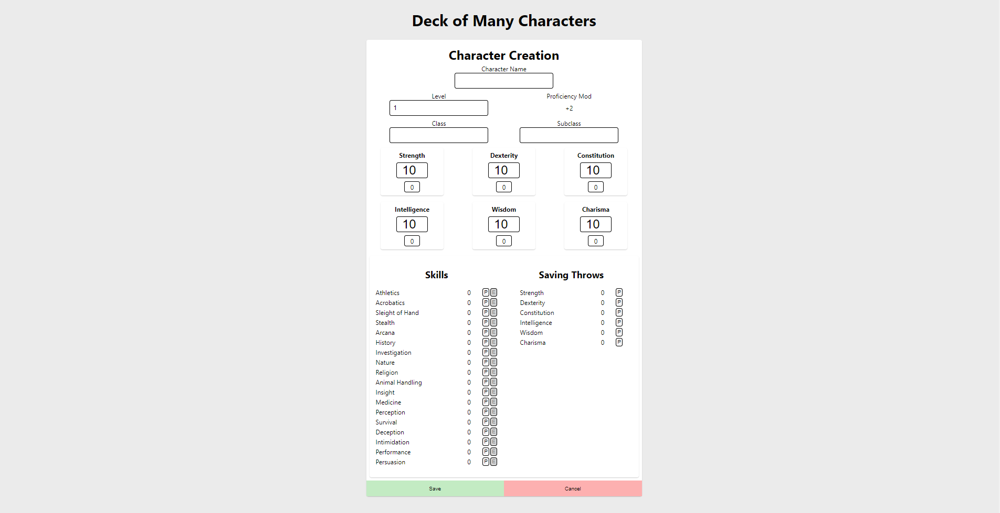

# [Deck of Many Characters](https://www.deckofmanycharacters.com/)

## Purose
Deck of Many Characters provides simple way to roll dice and create characters for Dungeons and Dragons 5th Edition! 

[Navigate to the Deck of Many Characters website.](https://www.deckofmanycharacters.com/) Start by selecting `Create New Character`

Fill out your characters info in the provided fields:

If you see some values changing as you update your character information don't worry! Modifiers for Proficiency, Ability Scores, and Skill update depending on the character's level, Ability Scores, and Proficiency/Expertise values. 

Once you complete the Character Creation Form, select `Save` and you'll be brought back to the landing page where your newly created character will be waiting!

From there you can `Delete` the character, or `Play!`. 

Selecting `Play!` will bring you to the Gameplay Page!

This is where I will have a screenshot once it's fully styled! 